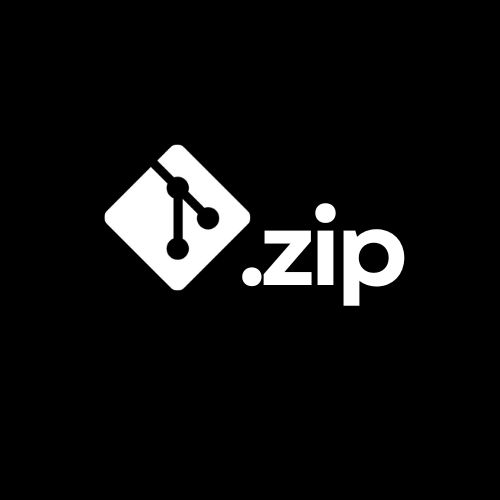
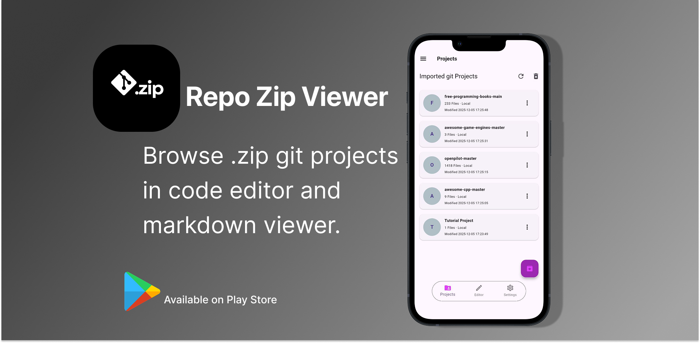
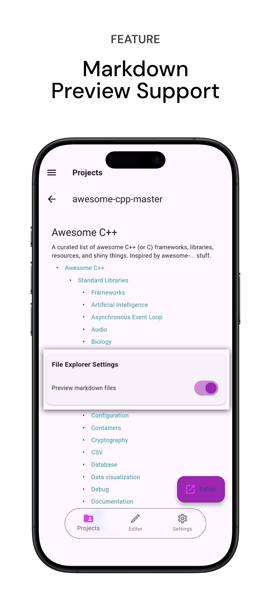

**English** | [简体中文](README_zh.md)

 

  

<h1 align="center">Repo Zip Viewer (RZV)</h1>

  
  
  
  

extract .zip Github/Gitlab/Bitbucket repositories and open files in code editor and markdown viewer in mobile, for students, code readers and quick access.

  

<table border="1">
  <tr>
    <th>OS</th>
    <th>Source</th>
  </tr>
  <tr>
    <td>Android</td>
    <td>
      
      
    </td>
  </tr>
</table>
 

Explore any Github, Gitlab or Bitbucket repository – just download it as a .zip and open it instantly in a beautiful, read-only code editor.

Perfect for:

- Studying open-source projects on the go
- Reviewing code during travel or commutes
- Quickly checking repos shared as zip downloads
- Learning from famous projects without setting up git

No cloning. No internet after import. Privacy-focused.

## Features

- Import any git repository as a `.zip` file (GitHub "Download ZIP", GitLab export, etc.)
- Download A Repository in Zip Manager, Extract it and start viewing & reading code.
- Full folder/file tree browser
- Syntax-highlighted read-only code editor ([VSCode Monaco Editor](https://github.com/omar-hanafy/flutter_monaco))
- Instant Markdown preview for READMEs and `.md` files
- Search across files and inside file contents
- Customizable: font size, font family, zoom, light/dark theme
- Toggleable File Explorer & advanced features via **Plugins** system
- Supports huge projects (with progress indicator during extraction)
- Multiple languages (English, Italian, French, German, Arabic, Spanish, Portuguese, Turkish, Chinese (Simplified & Traditional), Japanese, Korean, Russian)
- No unnecessary permissions – only storage access to read local .zip files

| Imported Projects |  Plugins Manager | Markdown Previewer |
|--------------------------|-----------------|---------------------|
|  |  |  |

| Code Editor | Advanced Options | Customizable Theme |
|------------------|--------------------|-----------------|
|  |  |  |

## How to Use

1. Download any repository as `.zip` from GitHub, GitLab, etc.
2. Open **Repo Zip Viewer (RZV)**
3. Tap **Import Project** → select your `.zip` file
4. Wait for extraction (progress shown for large projects)
5. Browse, search, and read code offline!

## Privacy & Permissions

- Read our Privacy policy, [view here](https://rzv.bilsul.com/privacy)
- Terms of Use, [view here](https://rzv.bilsul.com/terms)
- Only requires storage permission to read your `.zip` files
- No tracking, no analytics

---

**Repo Zip Viewer (RZV)** – View code anywhere, anytime.  

📱 Available on [Google Play]() (or [get the latest APK release](https://github.com/bilalsul/rzv/releases/latest))

## License

This project is licensed under the [MIT License](./LICENSE).

## Thanks

[flutter_monaco](https://github.com/omar-hanafy/flutter_monaco), which is MIT licensed, a flutter plugin for integrating the Monaco Editor (VS Code's editor) into Flutter applications via WebView.

[Anx Reader](https://github.com/Anxcye/anx-reader), MIT licensed Ebook Reader, thanks for the UI inspiration and such a plugin rich reading app. RZV UI is a reflection of this Cool Project.

And many [other open source projects](./pubspec.yaml), thanks to all the authors for their contributions.
