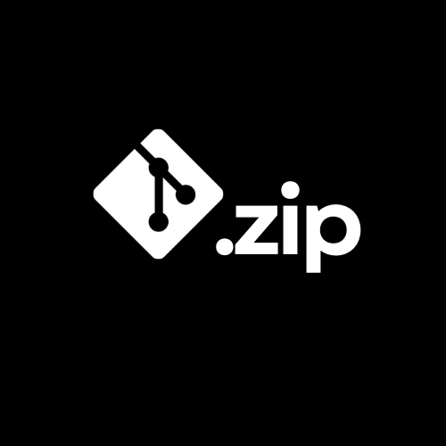
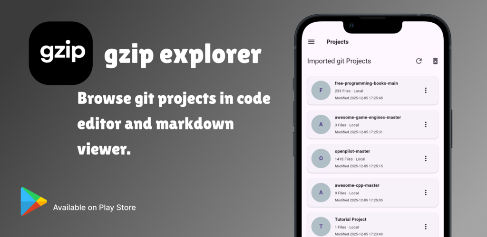
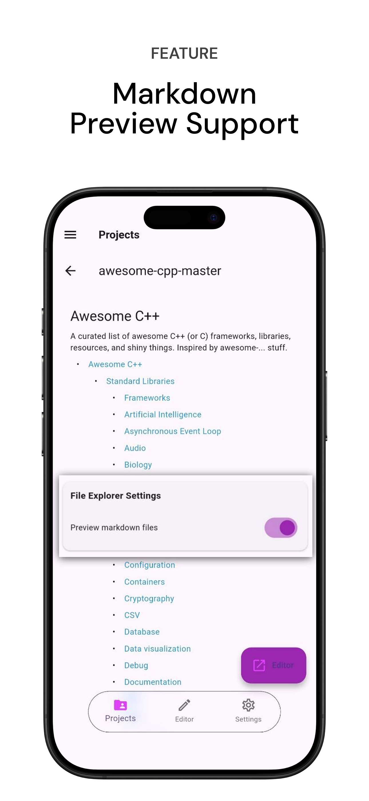
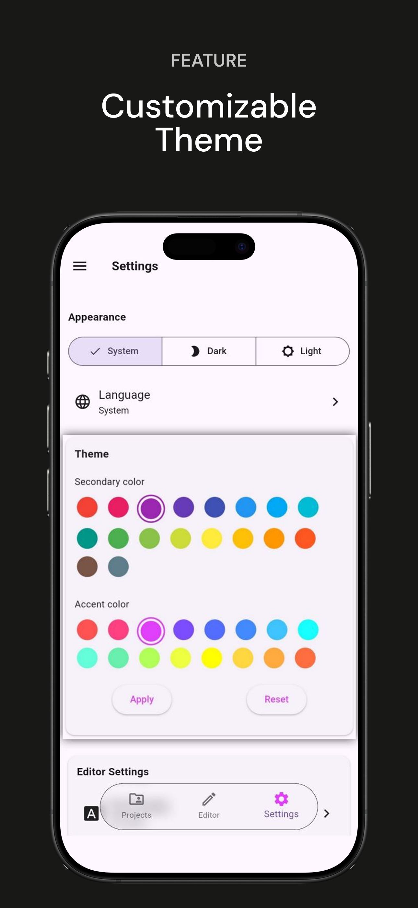

**English** | [简体中文](README_zh.md)

 

  

<h1 align="center">Repo Zip Viewer (RZV)</h1>

  
  
  
  

Extract .zip Github/Gitlab/Bitbucket repositories and open files in code editor and markdown viewer on mobile — perfect for students, code readers and quick access.

  

<table border="1">
  <tr>
    <th>OS</th>
    <th>Source</th>
  </tr>
  <tr>
    <td>Android</td>
    <td>
    <a href="https://f-droid.org/en/packages/rzv.bilsul.com">
    
    <a href="https://codeberg.org/bws/rzv/releases/latest">
    
    
  </a>
      
    </td>
  </tr>
</table>
 

Explore any Github, Gitlab or Bitbucket repository – just download it as a .zip and open it instantly in a beautiful, read-only code editor.

Perfect for:

- Studying open-source projects on the go
- Reviewing code during travel or commutes
- Quickly checking repos shared as zip downloads
- Learning from famous projects without setting up git

No cloning. No internet after import. Privacy-focused.

## Features

- Import any git repository as a `.zip` file (GitHub "Download ZIP", GitLab export, etc.)
- Download a repository in Zip Manager, extract it and start viewing & reading code
- Full folder/file tree browser
- Syntax-highlighted read-only code editor 
- Instant Markdown preview for READMEs and `.md` files
- Search across files and inside file contents
- Customizable: font size, font family, zoom, light/dark theme
- Toggleable File Explorer & advanced features via **Plugins** system
- Supports huge projects (with progress indicator during extraction)
- Multiple languages (English, Italian, French, German, Arabic, Spanish, Portuguese, Turkish, Chinese (Simplified & Traditional), Japanese, Korean, Russian)
- No unnecessary permissions – only storage access to read local .zip files

| Imported Projects          | Plugins Manager            |
|----------------------------|----------------------------|
|  |  |

| Markdown Previewer         | Code Editor                |
|----------------------------|----------------------------|
|  |  |

| Advanced Options           | Customizable Theme         |
|----------------------------|----------------------------|
|  |  |

| ZIP Manager                |
|----------------------------|
|  |

## How to Use

1. Download any repository as `.zip` from GitHub, GitLab, etc.
2. Open **Repo Zip Viewer (RZV)**
3. Tap **Import Project** → select your `.zip` file
4. Wait for extraction (progress shown for large projects)
5. Browse, search, and read code offline!

## Privacy & Permissions

- Read our Privacy policy, [view here](https://rzv.bilsul.com/privacy)
- Terms of Use, [view here](https://rzv.bilsul.com/terms)
- Only requires storage permission to read your `.zip` files
- No tracking, no analytics

---

**Repo Zip Viewer (RZV)** – View code anywhere, anytime.  

📱 Available on [Google Play](https://play.google.com/store/apps/details?id=com.bilalworku.gzip) (or [get the latest APK release](https://github.com/bilalsul/rzv/releases/latest))

## License

This project is licensed under the [GNU 3.0 License](./LICENSE).

## Thanks

[flutter_monaco](https://github.com/omar-hanafy/flutter_monaco), which is MIT licensed, a flutter plugin for integrating the Monaco Editor (VS Code's editor) into Flutter applications via WebView.

[Anx Reader](https://github.com/Anxcye/anx-reader), MIT licensed Ebook Reader, thanks for the UI inspiration and such a plugin rich reading app. RZV UI is a reflection of this Cool Project.

And many [other open source projects](./pubspec.yaml), thanks to all the authors for their contributions.
