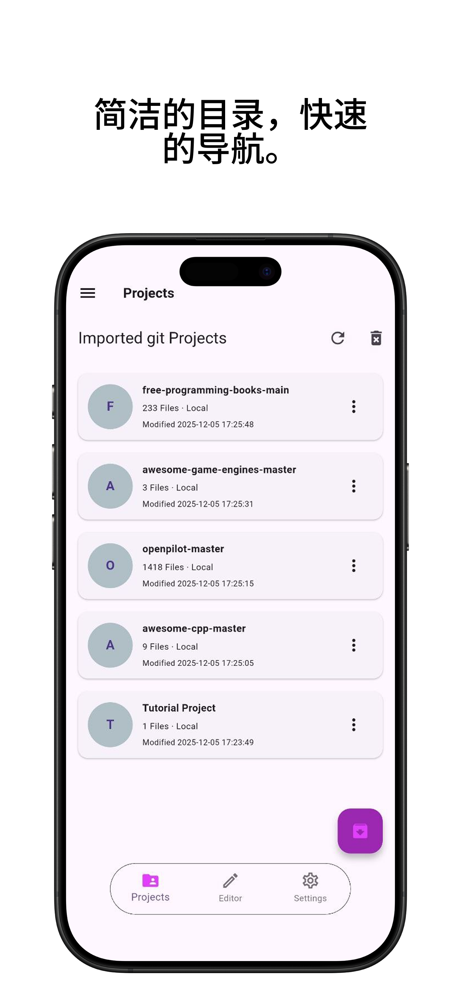
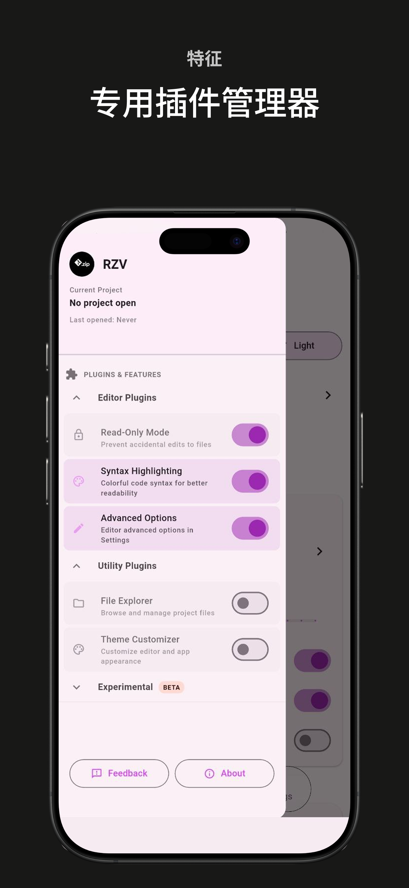
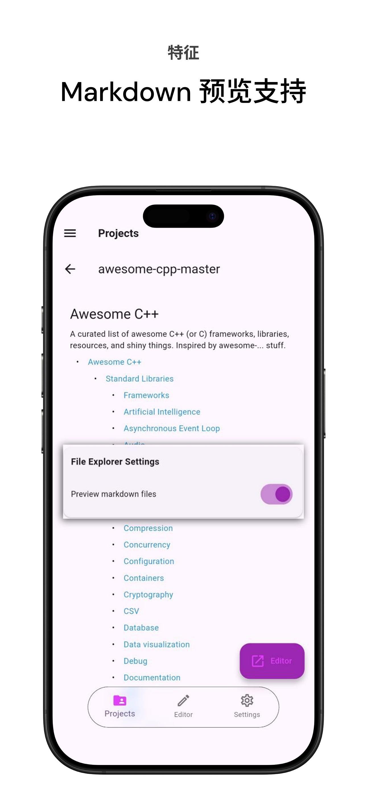
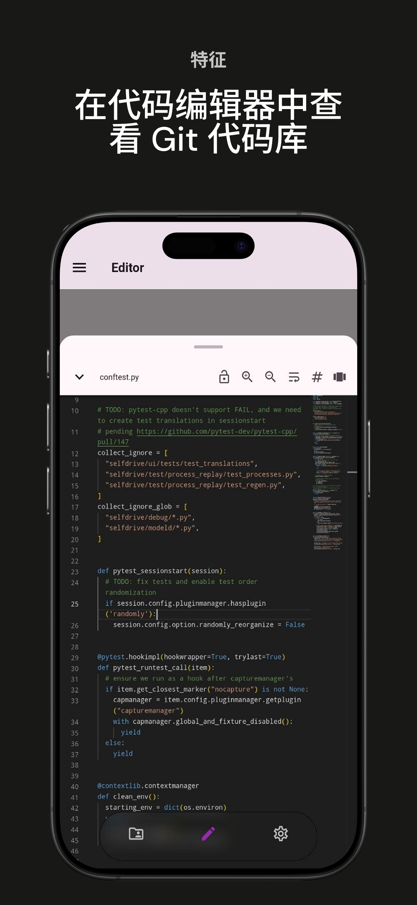
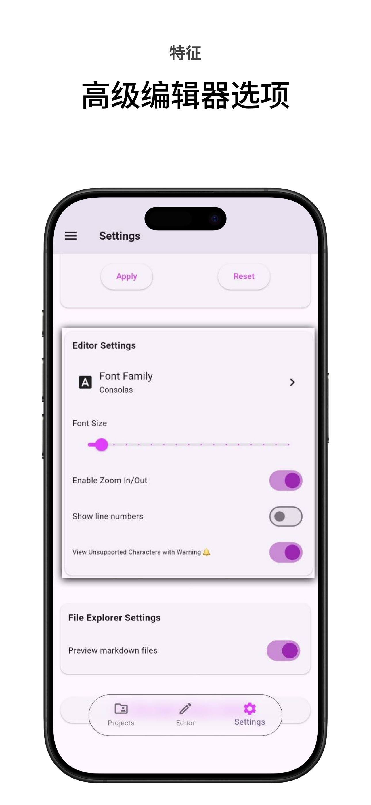
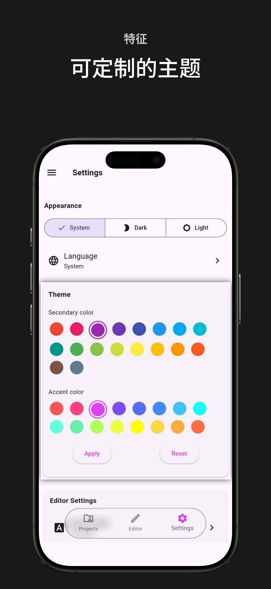
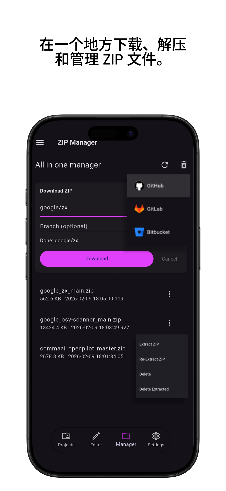

**简体中文** | [English](README.md)

 

  

<h1 align="center">Repo Zip Viewer (RZV)</h1>

  
  
  
  

提取 .zip Github/Gitlab/Bitbucket 仓库，并在移动设备上使用代码编辑器和 Markdown 查看器打开文件，适用于学生、代码阅读者和快速访问。

  

<table border="1">
  <tr>
    <th>操作系统</th>
    <th>来源</th>
  </tr>
  <tr>
    <td>Android</td>
    <td>
      
      
    </td>
  </tr>
</table>
 

探索任何 Github、Gitlab 或 Bitbucket 仓库 – 只需将其下载为 .zip 文件，即可在精美的只读代码编辑器中立即打开。

非常适合：

- 在路上学习开源项目
- 在旅行或通勤期间审阅代码
- 快速检查作为 zip 下载共享的仓库
- 无需设置 git 即可从著名项目中学习

无需克隆。导入后无需互联网。注重隐私。

## 功能

- 将任何 git 仓库导入为 `.zip` 文件（GitHub 的“Download ZIP”、GitLab 导出等）
- 在 Zip 管理器中下载仓库，提取它并开始查看和阅读代码。
- 完整的文件夹/文件树浏览器
- 语法高亮的只读代码编辑器（[VSCode Monaco Editor](https://github.com/omar-hanafy/flutter_monaco)）
- README 和 `.md` 文件的即时 Markdown 预览
- 跨文件搜索和文件内容内搜索
- 可自定义：字体大小、字体家族、缩放、亮/暗主题
- 通过 **插件** 系统可切换文件浏览器和高级功能
- 支持大型项目（提取过程中显示进度指示器）
- 支持多种语言（英语、意大利语、法语、德语、阿拉伯语、西班牙语、葡萄牙语、土耳其语、简体中文、繁体中文、日语、韩语、俄语）
- 无需多余权限 – 仅需存储访问权限来读取本地 .zip 文件

| 已导入项目 | 插件管理器 |
|--------------------------|-----------------|
|  |  |

| Markdown 预览器 | 代码编辑器 |
|---------------------|------------------|
|  |  |

| 高级选项 | 可自定义主题 |
|--------------------|-----------------|
|  |  |

| ZIP 管理器 |
|------------------|
|  |

## 如何使用

1. 从 GitHub、GitLab 等下载任何仓库为 `.zip` 文件。
2. 打开 **Repo Zip Viewer (RZV)**
3. 点击 **导入项目** → 选择您的 `.zip` 文件
4. 等待提取（大型项目显示进度）
5. 离线浏览、搜索和阅读代码！

## 隐私与权限

- 阅读我们的隐私政策，[查看这里](https://rzv.bilsul.com/privacy)
- 使用条款，[查看这里](https://rzv.bilsul.com/terms)
- 仅需存储权限来读取您的 `.zip` 文件
- 无跟踪、无分析

---

**Repo Zip Viewer (RZV)** – 随时随地查看代码。  

📱 可在 [Google Play]() 上获取（或 [获取最新 APK 版本](https://github.com/bilalsul/rzv/releases/latest)）

## 许可证

本项目采用 [MIT 许可证](./LICENSE)。

## 致谢

[flutter_monaco](https://github.com/omar-hanafy/flutter_monaco)，采用 MIT 许可证，是一个用于将 Monaco 编辑器（VS Code 的编辑器）通过 WebView 集成到 Flutter 应用程序中的 Flutter 插件。

[Anx Reader](https://github.com/Anxcye/anx-reader)，采用 MIT 许可证的电子书阅读器，感谢 UI 灵感和如此插件丰富的阅读应用。RZV 的 UI 是这个酷项目的反映。

以及许多 [其他开源项目](./pubspec.yaml)，感谢所有作者的贡献。
